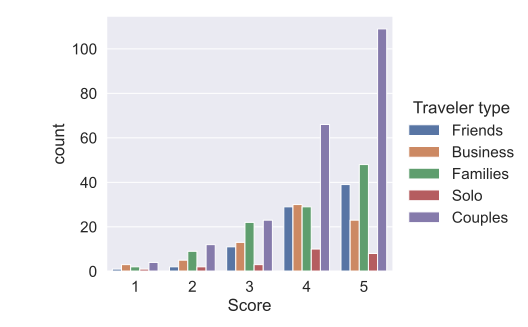

# 全局设置
##  seaborn字体大小和背景的设定

```python

sns.set(font_scale=1.3)
sns.set_style("darkgrid")
```
## 设置searnborn绘图的颜色,"Set", "Set2", "Tab10", "Paired"
palette=sns.color_palette("Set1")
# catplot()
kind可以设不同的类型，#boxplot 和 barplot都可以用sns.catplot()实现，分别设为kind="box"和kind="bar"。
- kind="point"的时候有点像barplot，把barplot的柱子最高点连起来
- kind="count", 有点像barplot
```python
sns.catplot(x="Score", data=reviews, kind="count",hue="Traveler type")
```


## 不同类型的catplot总结
- graphical form of a frequency table ： kind="count"。
- has the parameters, `join` and `dodge`, which can update the look of the lines in the plot: kind="point", dodge的意思是躲避，防止线重合。
- can be used to see the distribution and outliers of a numeric column： kind="box"
- is similar to a point plot and can be used to see the central tendency of numerical data: kind="bar"

## catplot()是FaceGrid类型的绘图
关于FaceGrid的知识参考[[数据可视化#seaborn绘图]]
```python
# Create a catplot for each "Period of stay" broken down by "Review weekday"
ax = sns.catplot(
# Make sure Review weekday is along the x-axis
x="Review weekday",
# Specify Period of stay as the column to create individual graphics for
col="Period of stay",
# Specify that a count plot should be created
kind="count",
# Wrap the plots after every 2nd graphic.
col_wrap=2,
data=reviews
)
```